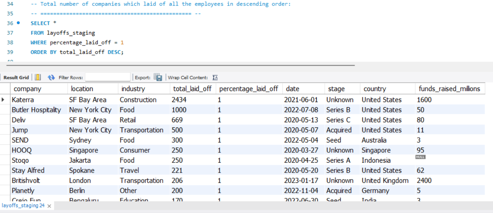
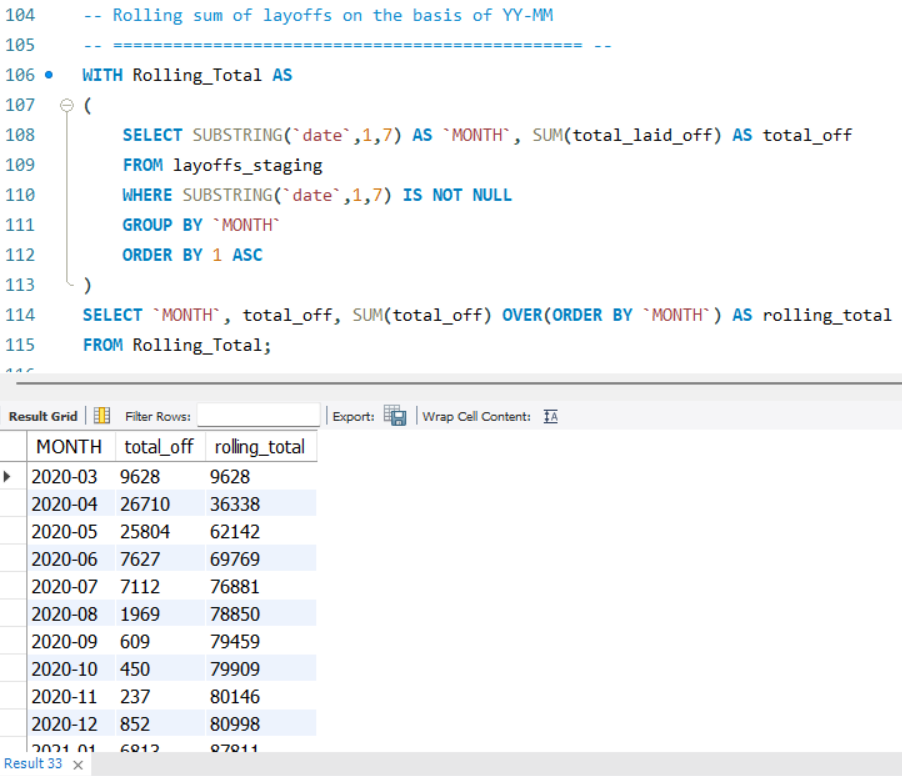

# World Layoffs - EDA

## About

This MySQL project focuses on conducting **Exploratory Data Analysis (EDA)** on a cleaned global layoffs dataset. The objective is to uncover key trends and patterns in employee layoffs across industries, countries, and years, and prepare insights for future dashboarding and reporting.

The dataset was sourced from the [Kaggle World Layoffs Dataset](https://www.kaggle.com/datasets/swaptr/layoffs-2022) and cleaned in the companion project, [World Layoffs - Data Cleaning](https://github.com/amanarya1r/World_Layoffs-Data_Cleaning).

## Purpose of the Project

The project aims to:

- Analyze the cleaned layoff data for hidden patterns and trends.
- Perform time-series breakdowns by month, year, industry, and country.
- Understand the impact on companies based on funding, industry, and location.
- Prepare insights that could help in visual dashboards and predictive models.

## Dataset Overview

The dataset used is the output of the [Data Cleaning Project](https://github.com/amanarya1r/World_Layoffs-Data_Cleaning), containing the following fields:

| Column                  | Description                                             | Data Type |
|--------------------------|---------------------------------------------------------|-----------|
| company                  | Name of the company where layoffs happened              | TEXT      |
| location                 | Headquarters or main location of the company            | TEXT      |
| industry                 | Sector in which the company operates                    | TEXT      |
| total_laid_off           | Number of employees laid off                            | INT       |
| percentage_laid_off      | Percentage of total workforce laid off                  | TEXT     |
| date                     | Date of the layoff event                                | DATE      |
| stage                    | Funding stage of the company                            | TEXT      |
| country                  | Country in which the layoff occurred                    | TEXT      |
| funds_raised_millions    | Total funds raised by the company (in millions)          | INT       |

## Approach Used

### Step 1: Data Import

- Imported the cleaned SQL file `/data/Layoffs_Data_Cleaning.sql` into MySQL Workbench.

### Step 2: Exploratory Data Analysis

Performed detailed queries to explore:

1. **Maximum Layoffs**
   - Highest number of employees laid off on a single day.

2. **Full Company Layoffs**
   - Identified companies that laid off 100% of their workforce.
   - Analyzed funding raised by these companies.

3. **Industry Analysis**
   - Which industries were impacted the most.

4. **Country Analysis**
   - Countries with the highest layoffs.

5. **Time Series Analysis**
   - Layoffs by year, month, and rolling totals across time.

6. **Company-wise Analysis**
   - Companies with the highest layoffs per year.
   - Ranking companies based on layoffs.

### Step 3: Advanced Queries

- Used **Window Functions** (DENSE_RANK) to find top 5 companies per year.
- Created **Common Table Expressions (CTEs)** for rolling sums and rankings.

## EDA Results (Snapshots)

  
Click to Expand

### Max employees laid off in a day:

### Max Percentage and Employees Laid off in a day:
> 1 means 100% which means whole country is laid off.

### Companies which laid off all employees: 

### Total number of companies which complete laid off of all employees:
> There are total 115 companies which completely laid off all the employees.

### Total number of companies which laid of all the employees in descending order:

### Highest funding raised by companies with a complete layoff:

### Sum of total laid off by each company(only in two table):

### Date from which layoffs started to last date at which layoffs recorded:

### What industries are hit the most during the time of layoffs:

  
Click to Expand Table

  | Industry        | Total Laid Off |
  |----------------|---------------|
  | Consumer      | 45182          |
  | Retail        | 43613          |
  | Other         | 36289          |
  | Transportation| 33748          |
  | Finance       | 28344          |
  | Healthcare    | 25953          |
  | Food         | 22855          |
  | Real Estate   | 17565          |
  | Travel        | 17159          |
  | Hardware      | 13828          |
  | Education     | 13338          |
  | Sales        | 13216          |
  | Crypto       | 10693          |
  | Marketing    | 10258          |
  | Fitness      | 8748           |
  | Security     | 5979           |
  | Infrastructure| 5785          |
  | Media        | 5234           |
  | Data         | 5135           |
  | Logistics    | 4026           |
  | Construction | 3863           |
  | Support      | 3523           |
  | HR           | 2783           |
  | Recruiting   | 2775           |
  | Product      | 1233           |
  | Legal        | 836            |
  | Energy       | 802            |
  | Aerospace    | 661            |
  | Fin-Tech     | 215            |
  | Manufacturing| 20             |
  | Gaming       | (no data)      |

### Countries with most layoffs:

  
Click to Expand Table

  | Country              | Total Laid Off |
  |----------------------|---------------|
  | United States       | 256,559        |
  | India              | 35,993         |
  | Netherlands        | 17,220         |
  | Sweden             | 11,264         |
  | Brazil             | 10,391         |
  | Germany            | 8,701          |
  | United Kingdom     | 6,398          |
  | Canada             | 6,319          |
  | Singapore          | 5,995          |
  | China              | 5,905          |
  | Israel             | 3,638          |
  | Indonesia          | 3,521          |
  | Australia          | 2,324          |
  | Nigeria            | 1,882          |
  | United Arab Emirates | 995          |
  | France             | 915            |
  | Hong Kong          | 730            |
  | Austria            | 570            |
  | Russia             | 400            |
  | Kenya              | 349            |
  | Estonia            | 333            |
  | Argentina          | 323            |
  | Senegal            | 300            |
  | Mexico             | 270            |
  | Ireland            | 257            |
  | Finland            | 250            |
  | Spain              | 250            |
  | Denmark            | 240            |
  | Myanmar            | 200            |
  | Norway             | 140            |
  | Colombia           | 130            |
  | Bulgaria           | 120            |
  | Portugal           | 115            |
  | Malaysia           | 100            |
  | Japan              | 85             |
  | Romania            | 80             |
  | Seychelles         | 75             |
  | Switzerland        | 62             |
  | Lithuania          | 60             |
  | Thailand           | 55             |
  | Luxembourg         | 45             |
  | New Zealand        | 45             |
  | Chile              | 30             |
  | Poland             | 25             |
  | Pakistan           | -              |
  | Hungary            | -              |
  | Italy              | -              |
  | Turkey             | -              |
  | South Korea        | -              |
  | Vietnam            | -              |
  | Egypt              | -              |

### Years with the highest layoffs:

### Stage at which companies laid off:

### Layoffs on the basis of months:

### Layoffs on the basis of YY-MM:

### Rolling sum of layoffs on the basis of YY-MM:

### Companies laying off per year:

### Companies laying off per year and which year they laid off the most:

### Years at which companies laid off the most:

### Highest laid off by companies per year:

### Highest laid off by companies per year and rank:

### Highest laid off by companies per year and rank of top 5:

## Key Learnings

- Gained hands-on experience with **Advanced SQL** techniques like **window functions** and **CTEs**.
- Understood how to structure **time-series analysis** for real-world datasets.
- Learned best practices for presenting data insights using **tables**, **details expansion**, and **snapshot visualizations**.

## Tools Used

- **MySQL** – for running SQL queries and analysis
- **Kaggle** – for sourcing the dataset
- **VS Code** – for documenting queries

